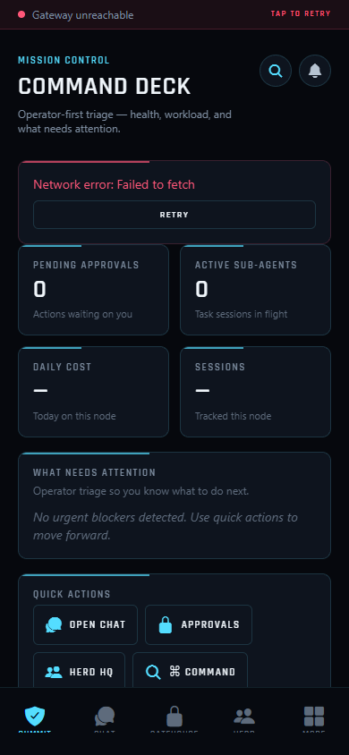
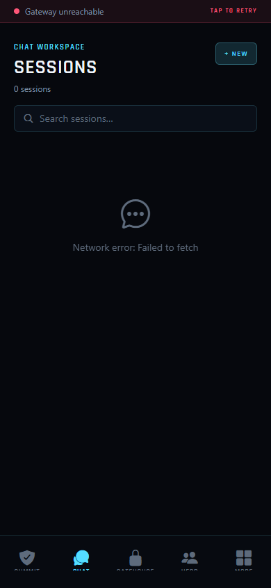
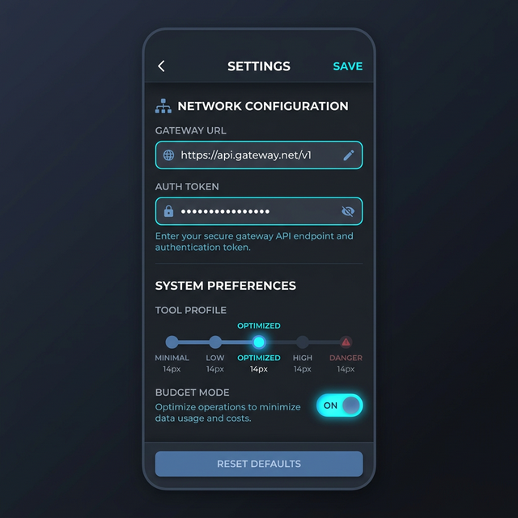

# 🐐 GoatCitadel Mobile

> **GoatCitadel Mobile** is the operator-first companion app for GoatCitadel, bringing Mission Control directly to your Android device.

Built with React Native and Expo, this app connects to your self-hosted GoatCitadel gateway to provide real-time AI command and control on the go while preserving the same sharp, high-signal design language as the desktop surface.

<p align="center">
  
  
  
</p>

## 🚀 Features

- **Command Deck:** Real-time system vitals, agent heartbeat, and unread notifications at a glance.
- **Premium Chat:** Rich, mobile-optimized chat interface for `Chat`, `Cowork`, and `Code` modes.
- **Gatehouse Approvals:** Review and authorize pending actions and tool executions from anywhere.
- **Herd Management:** Inspect agent profiles, roles, active sessions, and specialties.
- **System Governance:** Cycle skill states, connect/disconnect MCP servers, set tool risk profiles, and manage budget modes.
- **System Logs & Pulse:** Live event streaming and real-time backend log tailing directly on your device.

## 📦 Installation

A pre-built APK is included in the root of this repository for immediate sideloading on Android devices.

1. Download [`GoatCitadel.apk`](./GoatCitadel.apk) from this repository to your Android device.
2. Open the file and follow the system prompts to install (you may need to allow installation from unknown sources).
3. Open the app and enter your GoatCitadel Gateway URL (and Auth Token if enabled) to connect!

## 🛠️ Local Development

### Prerequisites

- Node.js (v18+)
- [Expo CLI](https://docs.expo.dev/get-started/installation/)
- Android Studio / Android SDK (for local compilation)
- `adb` and the Android emulator available either on `PATH` or under `ANDROID_SDK_ROOT` / `ANDROID_HOME`

### Running Locally

1. Clone the repository:
   ```bash
   git clone <your-private-mobile-repo-url>
   cd <your-mobile-repo-folder>
   ```

2. Authenticate to GitHub Packages once for the shared contracts package:
   ```bash
   npm login --scope=@goatcitadel --registry=https://npm.pkg.github.com
   ```
   Use a GitHub Personal Access Token with `read:packages` when npm prompts for your password.

3. Install dependencies:
   ```bash
   npm install
   ```

4. Start the Expo development server:
   ```bash
   npx expo start
   ```

Press `a` to run on an attached Android device/emulator, or scan the QR code using the Expo Go app.

### Emulator And Proofing Workflow

Use the scripted Android workflow before handing the app off for proof or QA:

1. Run the environment preflight:
   ```bash
   npm run android:doctor
   ```
   This checks the Android SDK, `adb`, emulator binary, available AVDs, connected devices, and the current APK artifact.

2. List available emulators:
   ```bash
   npm run android:avd:list
   ```

3. Start the emulator you want to use:
   ```bash
   set ANDROID_AVD=Medium_Phone_API_35
   npm run android:emulator:start
   ```
   You can also pass `--avd <name>` directly to the script.

4. Install the current APK once the emulator is visible in `adb devices -l`:
   ```bash
   npm run android:install:apk
   ```

5. If the GoatCitadel gateway is running locally on the same workstation, bridge it into the emulator:
   ```bash
   adb reverse tcp:8787 tcp:8787
   ```

6. Open the login gate manually or deep-link the emulator straight into a local bootstrap flow:
   ```bash
   adb shell am start -a android.intent.action.VIEW -d "goatcitadel://login?url=http%3A%2F%2F127.0.0.1%3A8787\&autoverify=1" com.goatcitadel.mobile
   ```
   When you add more query params like `token=<bearer>` or `label=<device-name>`, escape every `&` as `\&`. Without that, `adb shell` only preserves the first query param and silently drops the rest.

7. Generate a handoff-ready proof checklist and environment snapshot:
   ```bash
   npm run android:proof:handoff
   ```
   The report is written to `artifacts/android-proof-handoff.md` and is intended to be updated with screenshot paths and manual observations after the test run.

### Building the APK Locally

To compile a standalone APK exactly like the one provided:

```bash
cd android
./gradlew assembleRelease
```
The output will be found in `android/app/build/outputs/apk/release/app-release.apk`.

If you want the repo-root `GoatCitadel.apk` to stay current for handoff and sideloading, rerun:

```bash
npm run build:apk
```

## 🔗 Main Repository

This project is the mobile frontend for the GoatCitadel ecosystem. For the core orchestration engine, CLI tools, desktop Mission Control, and server components, please visit the main repository:

**your private GoatCitadel core repository**
